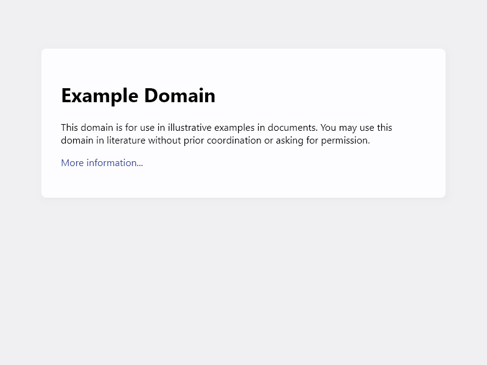

= Puppeteer test
John Schuster <John.schuster@PhoenixWorkgroup.com>
v2.1b, 11/04/2019: Doco Type
:Author: John HR Schuster
:Company: Phoenix Learning Labs
:title-page:
:toc: left
:toclevels: 4:
:source-highlighter: coderay
:coderay-css: class
:coderay-linenums-mode: inline
:pagenums:
:numbered: 
:chapter-label: 
:experimental:
:icons: font
:docdir: ./documents
:github: https://github.com/GeekMustHave/puppeteer-test
:linkattrs:
:seclinks:
:pagenums:
:title-logo-image: ./images/create-doco_gmh-blogArticle-cover.png

Now for something simple with the new version of Puppeteer v2.0.

To get a PDF version of this repository click on this link:./readme.pdf[window='_blank']

== Installation

To use Puppeteer in your project, run:

      npm i puppeteer

NOTE: When you install Puppeteer, it downloads a recent version of Chromium (~170Mb Mac, ~282Mb Linux, ~280Mb Win) that is guaranteed to work with the API. To skip the download      

== Example PNG

First program takes a PNG of the `example.com` web page

.example.js
[source,javascript]
----
include::./example.js[Example1]
----

Which when it's run with the 

  node example.js

Result in the `example.com` website being called up and a snapshot taken into a `png` file.

.Captured PNG file

Puppeteer sets an initial page size to 800px x 600px, which defines the screenshot size. The page size can be customized with link:https://pptr.dev/#?product=Puppeteer&version=master&show=api-pagesetviewportviewport[ Page.setViewport(), window='_blank']

== Example PDF

Second program produces a PDF file

.hn.js
[source,javascript]
----
include::./hn.js[]
----

Result is the `hn.pdf` file being created from the `ycombinator.com` web page.

Click on the following link:./hn.pdf[link,window='_blank'] to see the generated file.

<<<<
== Document History

.Document History
[cols='2,2,2,6' options='header']
|===
| Date  | Version | Author | Description
| 11/04/2019 | V2.1b | JHRS |  Initial version
|===

////
This template created by GeekMustHave
////

